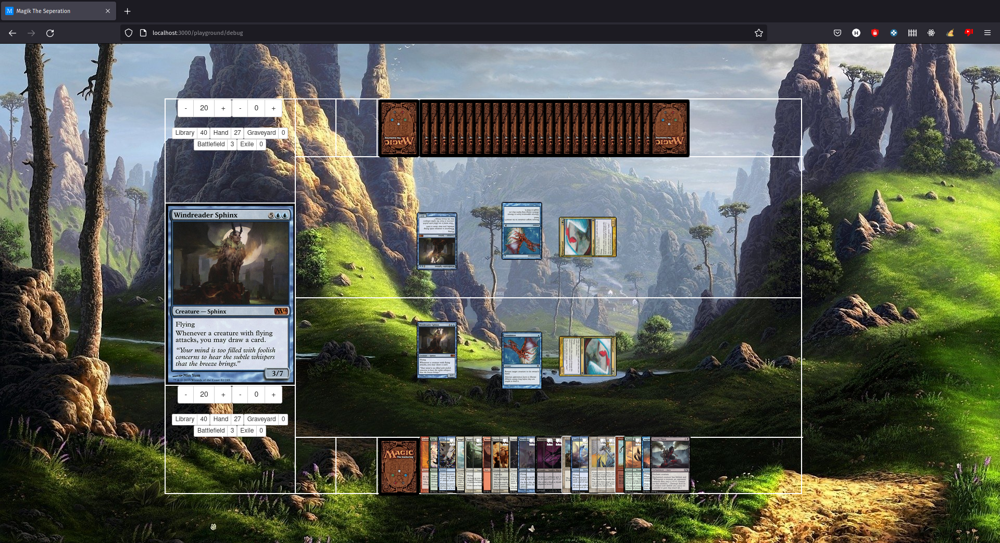
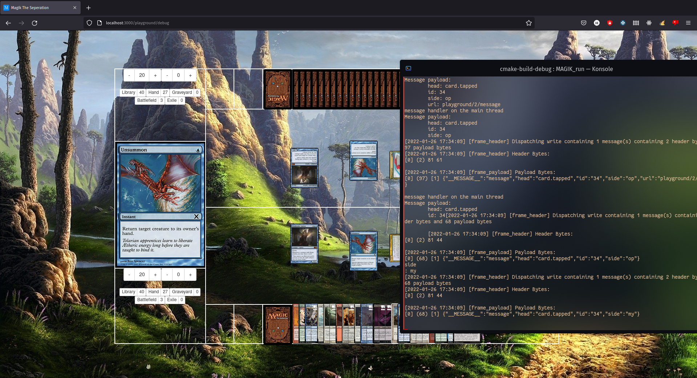

<h1 align="center">
    Magik : The Seperation
</h1>
<h6 align="center">
    The Web Game Running on a C++ Server
</h6>

***

## Dependencies
#### Backend

To be able to run the C++ websocket server and/or test the game logic, the following dependencies are **required**:
1. A C++11 Compiler (GCC, MSVC, Clang, MinGW) or later
2. CMake (version 3.5 or later)

The rest of the dependecies (Websocket++, JSONCPP, Asio) are already included in this project and will be automatically compiled by CMake.

#### Frontend

To be able to run the web GUI the following dependencies are **required**:
1. Node.js (at least version 14)
2. Npm

Then run the following commands to install some global packages through npm (root access may be required)

    $ npm install -g grunt-cli grunt bower

The rest of the frontend dependencies are in the `package.json` and `bower.json` in `src/public`. Cd there and run the following command:

    $ npm install
    $ bower install

***

## How to Run

To build the C++ server and game, all you have to do is run the following commands:

    $ mkdir build && cd build
    $ cmake ..

Then you can use `make` or `ninja` to generate the executable

    $ make
    $ ./MAGIK_run

For the frontend all you have to do is run the `app.js` in `src/public` directory:

    $ cd src/public
    $ node app

This should open the access to port 3000 (if not obviously something didn't work, open an issue or something.)

***

## Gallery

***

## Platform Compatibility

This project is platform independent (which is not easy because of C++ networking drama). It should run flawlessly on Linux, Windows and MacOS.

**It was only tested on Windows and Linux however**.

<h6>ArCh bTw</h6>

